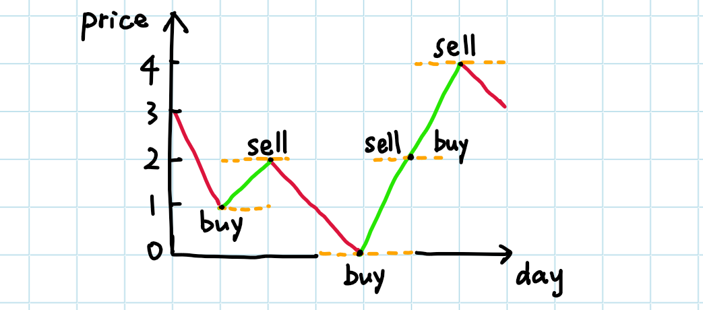

### 题目: 买卖股票的最佳时机 II
> 输入: prices = [7,1,5,3,6,4]  
> 输出: 7  
> 解释: 在第 2 天（股票价格 = 1）的时候买入，在第 3 天（股票价格 = 5）的时候卖出, 这笔交易所能获得利润 = 5-1 = 4 。  
>     随后，在第 4 天（股票价格 = 3）的时候买入，在第 5 天（股票价格 = 6）的时候卖出, 这笔交易所能获得利润 = 6-3 = 3 。


```
/**
 * @param {number[]} prices
 * @return {number}
 *
 * 思想一: 双指针(也可改为单指针,因为不会出现跨元素相减,可以用+1/-1找下一个元素)
 * 1.成本<卖价即可卖出（可理解为直线图，上升直线即为攒钱区域）
 * 2.累加上面的即可
 */
var maxProfit = function(prices) {
    if(!prices.length) return 0
    let cost,
        price,
        profit = 0
    for(let i = 1; i < prices.length; i++) {
        cost = prices[i - 1]
        price = prices[i]
        if(cost < price) {
            profit += (price - cost)
        }
    }

    return profit
};
```

* 技巧: 无

* 学习:   
1.通过折线图理解题目(上升区域相加即为攒钱最多的值)


* 总结:   
1.使用for循环比while快 *2 (#122、#189)
