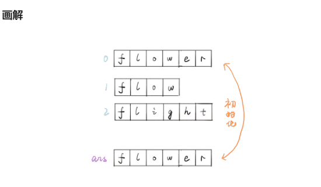

### 题目: 最长公共前缀
##### 编写一个函数来查找字符串数组中的最长公共前缀。如果不存在公共前缀，返回空字符串 ""。

> 输入：strs = ["flower","flow","flight"]  
> 输出："fl"  
> 输入：strs = ["dog","racecar","car"]  
> 输出：""  
> 解释：输入不存在公共前缀。
&nbsp;
---
思路一:  
1.暴力破解,拿到第一个元素A,循环元素A拿到下标下标，循环剩余元素对比下标
* 执行用时：80 ms, 在所有 JavaScript 提交中击败了46.28%的用户
* 内存消耗：41.1 MB, 在所有 JavaScript 提交中击败了5.04%的用户

思路二:  
1.优化: 拿到第一个元素A, 循环剩余元素(对比第二个拿到公共前缀, 再拿公共前缀和第三项对比)
* 执行用时：64 ms, 在所有 JavaScript 提交中击败了97.11%的用户
* 内存消耗：40.5 MB, 在所有 JavaScript 提交中击败了7.61%的用户

---

&nbsp;

```
/**
 * @param {string[]} strs
 * @return {string}
 */
var longestCommonPrefix = function(strs) {
    if(strs.length === 0) { return "" }

    let len = strs.length
    let start = strs[0]
    
    for(let i = 1; i < strs.length; i++) {
        let j = 0
        for(; j < start.length; j++) {
            if(start[j] !== strs[i][j]) {
                start = start.slice(0, j)
                break;
            }
        }
        if(start === "") { return start }
    }

    return start
};
```

* 技巧: 无 

* 优化空间: 无

* 学习: 
1.使用暴力破解后考虑有没办法减少循环次数★★

* 总结: 无
