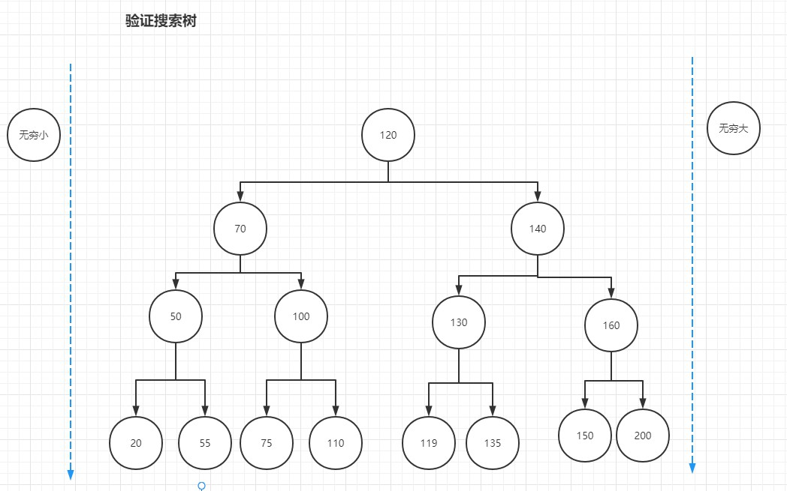

### 题目: 验证二叉搜索树
##### 给你一个二叉树的根节点 root ，判断其是否是一个有效的二叉搜索树。

&nbsp;
> 有效 二叉搜索树定义如下：  
  节点的左子树只包含 小于 当前节点的数。  
  节点的右子树只包含 大于 当前节点的数。  
  所有左子树和右子树自身必须也是二叉搜索树。    

> 输入：root = [2,1,3]  
  输出：true  
> 输入：root = [5,1,4,null,null,3,6]  
  输出：false  
  解释：根节点的值是 5 ，但是右子节点的值是 4 。  


---

思路一: (画图后从上往下看)  
1.递归(循环不等式, 每一次的值都在一个区间[l, r)之间,因此递归式应该传当前val、区间的 l 和 r 值)

思路二: (画图后从下往上看)  
比如50要在区间(20, 55)内、120要在区间(110,119)内，否则就是错的    
通过一个变化的对比值+队列+中序遍历实现；  
1.左侧值全部推入队列, 逐个pop出来，与对比值对比，
如果有右值，先推入右值，然后推入所有左值，继续循环

---

&nbsp;

```
var isValidBST = function (root) {
    return helper(root, -Infinity, Infinity)
};

function helper(root, l, r) {
    if(root === null) {
        return true
    }
    if(root.val <= l || root.val >= r) {
        return false
    }

    // 判断左右都满足条件时使用"&&"
    // 尝试使用了[].concat()
    return helper(root.left, l, root.val) && helper(root.right, root.val, r)
}
```

* 技巧: 无 

* 优化空间: 无

* 学习: 
1.在初解中尝试使用[].concat来解决,对递归使用欠缺实战
★★ 2.需要左右都满足条件的,使用 `return 递归(A) && 递归(B)` 来返回
★★ 3.递归的时候尽量列一下循环不等式,等式的前几次没值的话可以考虑传入特定值占位

* 总结: 
