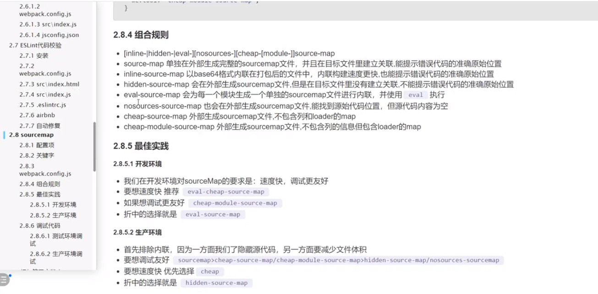
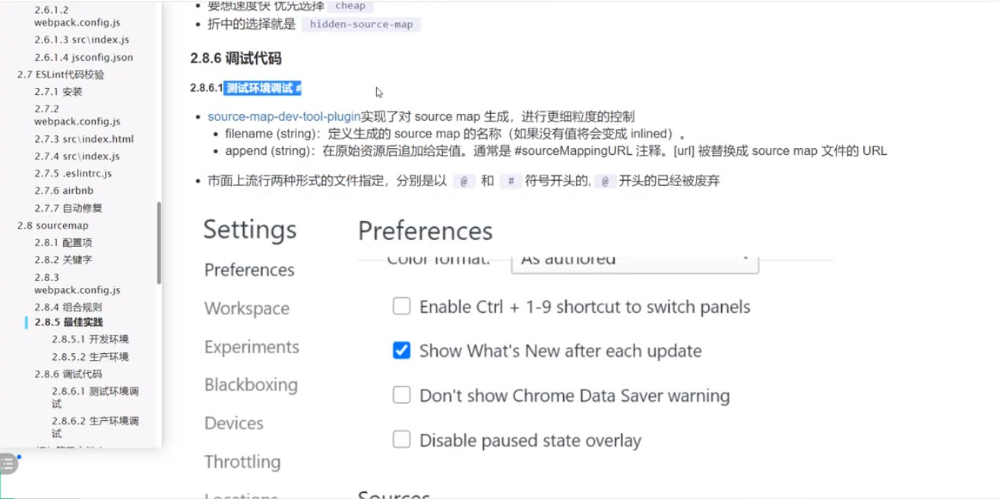
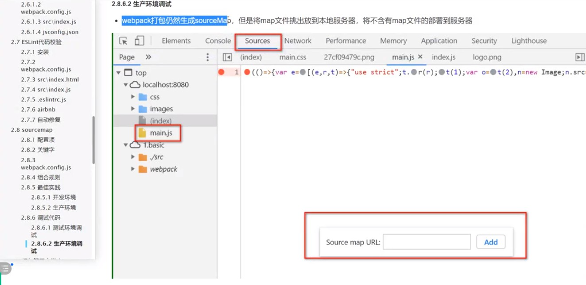
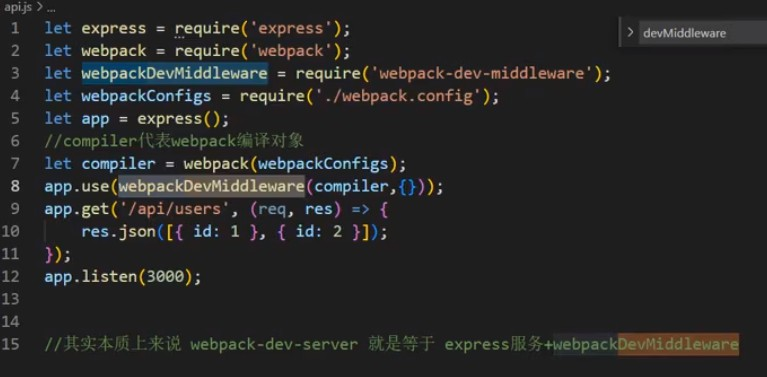

### 1.webpack介绍

内部生成依赖图 => 根据依赖图打包代码


### 2.sourcemap

eval、source-map、cheap、module、inline




调试测试环境, 利用source-map-tool-plugin + filemanager-webpack-plugin实现

添加下面配置到webpack的plugin

```
// 配置输出sourcemap并在项目文件写入内容
new webpack.SourceMapDevToolPlugin({
    append: `\n//# sourceMappingURL=http://127.0.0.1:8081/[url]`, // 插入到源文件末尾
    filename: `[file].map` // 示例: main.js 输出为 main.js.map
}),

// 把文件拷贝到maps目录, 不放在项目里
new FilemanagerPlugin({
    events: {
        onEnd: {
            copy: [
                {
                    source: './dist/*.map',
                    destination: path.resolve(__dirname, './maps')
                }
            ],
            delete: ['./dist/*.map']
        }
    }
})

```

在maps目录http-server启动本地服务,端口8081, 既可以断点调试测试环境



调试正式环境, 使用hidden-source-map配置生成sourcemap, 单独放到一个服务器(假设为A服务器)
然后打开生产环境,F12打开调试->Sources标签->选择文件->右键->Add Source Map->粘贴SourceMap的url(A服务器访问的sourcemap的url)




### 2.1 devServer

webpack-dev-server = webpack-dev-middleware + express




### 3.loader备注

loader执行优先级enforce:: 'pre'、'normal'、'post'、inline  // 先、中、后后执行、内联执行

- style-loader 用来把css转js脚本插入到DOM中
- css-loader 用来处理@import和url()
- less-loader 用来把less转css
- sass-loader 用来把sass转css
- postcss-loader 处理css兼容性 [如transform] [配合postcss.config.js, 写明需要兼容的浏览器]
- url-loader => asset/inline 导出一个资源的 data URI
- file-loader => asset/resource 发送一个单独的文件并导出 URL (webpack5 file-loader已废弃, 改用asset/resource)
- babel-loader 这个loader只是一个转换函数, 并不能识别js语法, 也不知道如何转换
    - 真正转语法的是@babel/core和@babel/preset-env
    - 
    - @babel/core js转js语法树
    - @babel/preset-env 预设的套餐(将多个转换规则集合到一起, 如箭头函数: plugin-transform-arrow-function就集成在里面)
    - @babel/@babel/preset-react react预设的套餐
    -
    - @babel/plugin-proposal-decorators 把类和对象的装饰器编译成ES5 (legacy: true表示使用旧的装饰器语法, 写在方法的上面)
    - @babel/plugin-proposal-class-properties 转换静态类属性以及使用属性初始值化语法声明的属性 (loose: true表示类转函数之后, 
    类上面的属性能转成两种形式, true/false就是选择要转成其中一种形式)
- eslint-loader 进行eslint检测和修复 (不想自己配置可以使用airbnb的一套配置)


### 4.plugin备注

- html-webpack-plugin 定义模板html
- Webpack.DefinePlugin 全局替换项目字符串
- clean-webpack-plugin 清空打包后的目录


### 踩坑

#### 问题1. webpack.config.js名字、位置、配置均正确, 但就是不执行

> 具体情况:  
> webpack不默认执行该配置,  
> 使用webpack --config ebpack.config.js , 重新执行 `npm run build` 提示找不到文件

> 解决: 删除文件, 重新新建后正常  
> 排查:文件名前多了个空格

#### 问题2.webpack-dev-server的contentBase属性改成了static

> 具体情况:
> 添加一个额外的目录, 使用contentBase不生效, 使用static可以

> 排查: 中文文档还没更新, 英文文档更新了static的使用

#### 问题3.使用eslint-loader的时候报错
TypeError: Cannot read property 'getFormatter' of undefined

解决: eslint版本从8将为7.32.0

#### 问题4: filemanager-webpack-plugin的delete配置不生效

处理: 手动rm -rf ./dist/*.map

未解决

#### 问题5: css里面使用url图片, 打包出来两张图片, 且项目打包后图片路劲有问题

原因: github提示file-loader不支持webpack5,需要改用下面的

- url-loader => asset/inline 
- file-loader => asset/resource

解决