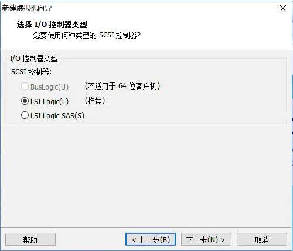
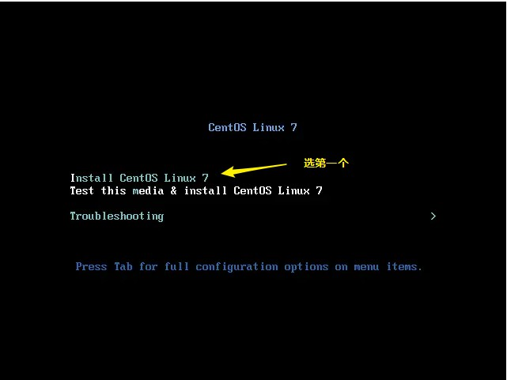
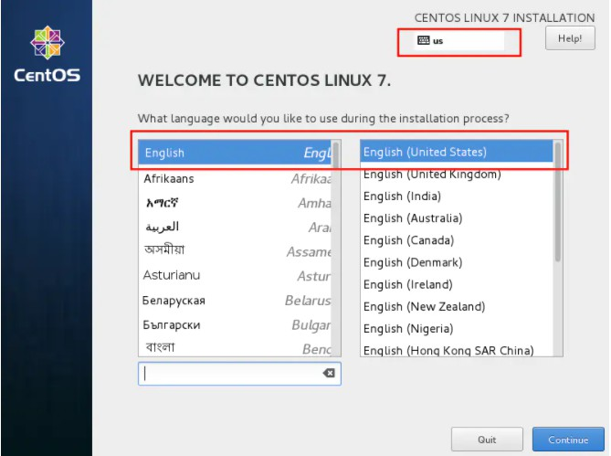
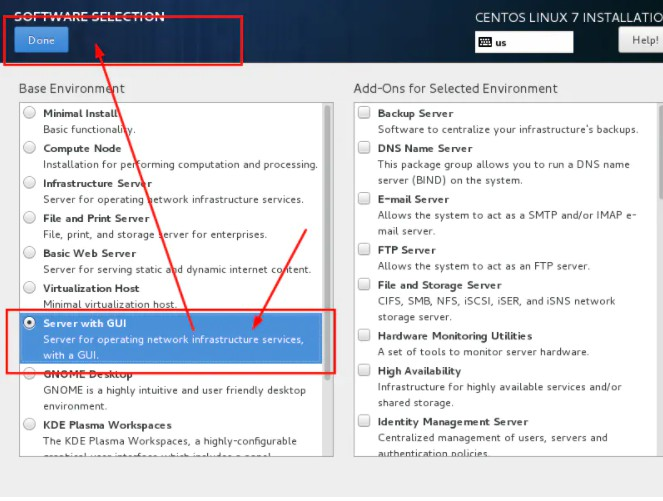
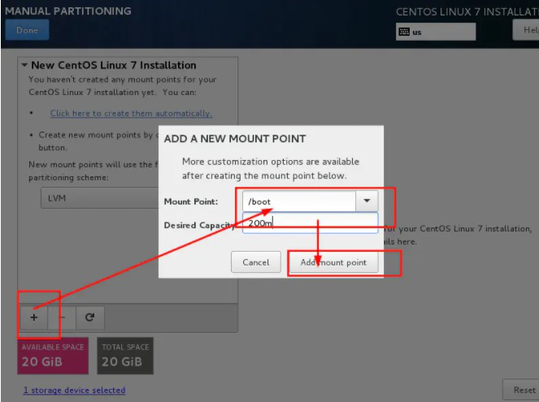
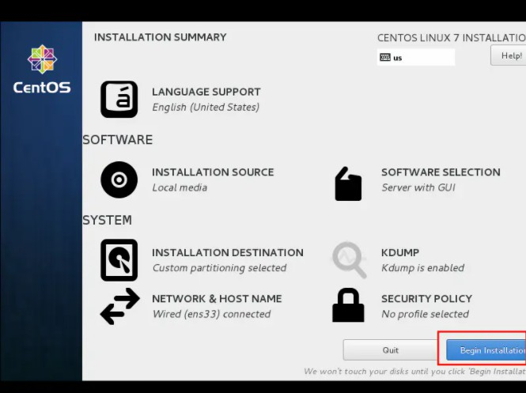
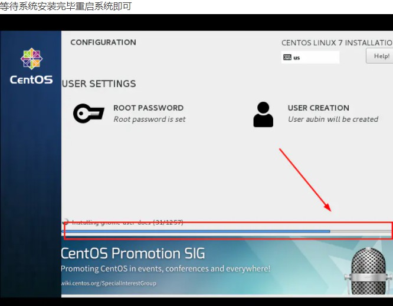

### 一、搭建准备

本地window10操作系统

vmware版本: VMware Workstation Pro (14版本)

[centos版本](https://mirrors.aliyun.com/centos/): CentOS-7-x86_64-DVD-2009.iso

注意: 文章标注的版本尽量保持一致, 重要!!!

虚拟机硬件条件: 2核8G

### 二、VMwear安装Centos7超详细过程


#### 1.新建虚拟机


&nbsp;


&nbsp;


&nbsp;


&nbsp;


&nbsp;


&nbsp;


&nbsp;


&nbsp;



&nbsp;


&nbsp;


&nbsp;


&nbsp;


&nbsp;


&nbsp;


&nbsp;



&nbsp;



&nbsp;


&nbsp;


&nbsp;


&nbsp;



&nbsp;


&nbsp;


&nbsp;



&nbsp;


&nbsp;


&nbsp;


&nbsp;


&nbsp;



&nbsp;


&nbsp;


&nbsp;



&nbsp;

```
转载: https://www.jianshu.com/p/ce08cdbc4ddb?utm_source=tuicool&utm_medium=referral
参考: https://www.jianshu.com/p/ce08cdbc4ddb?utm_source=tuicool&utm_medium=referral
      https://blog.csdn.net/babyxue/article/details/80970526
注意: kali下载包会有缺特定版本问题
      vmware配置Centos的时候尽量多克隆系统(方便重来)
```


