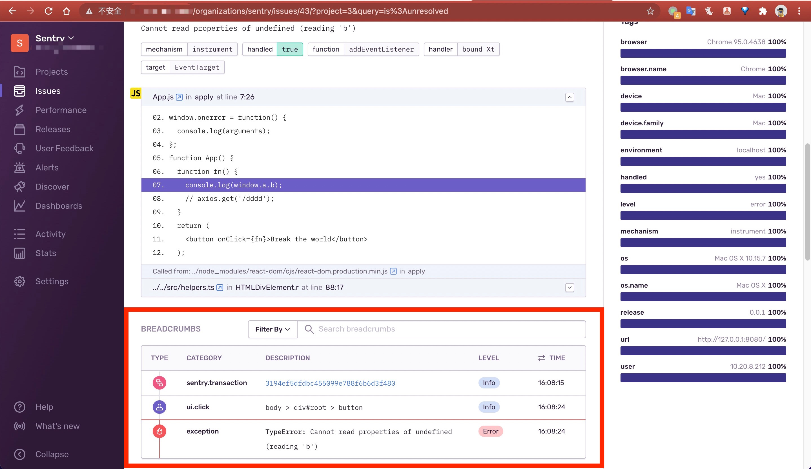
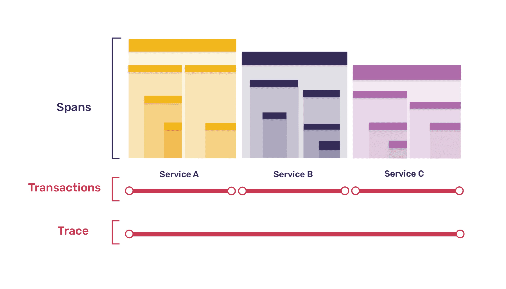
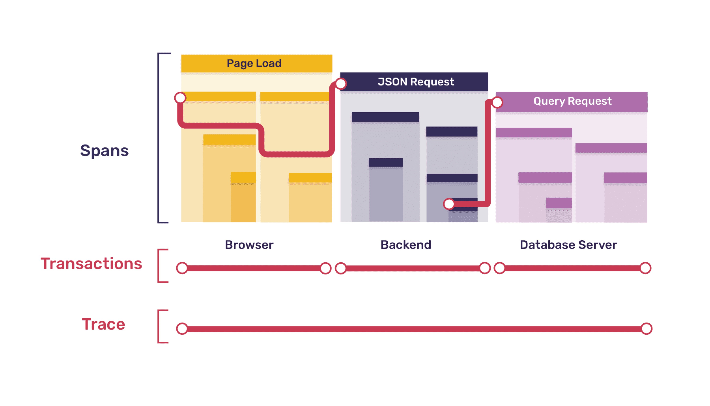
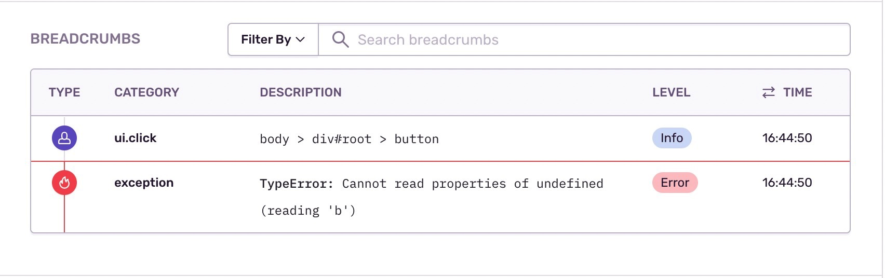
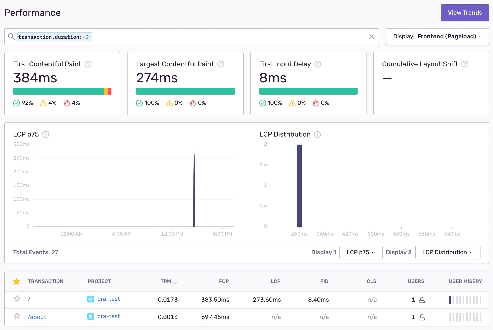
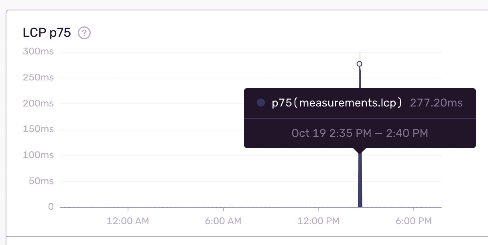
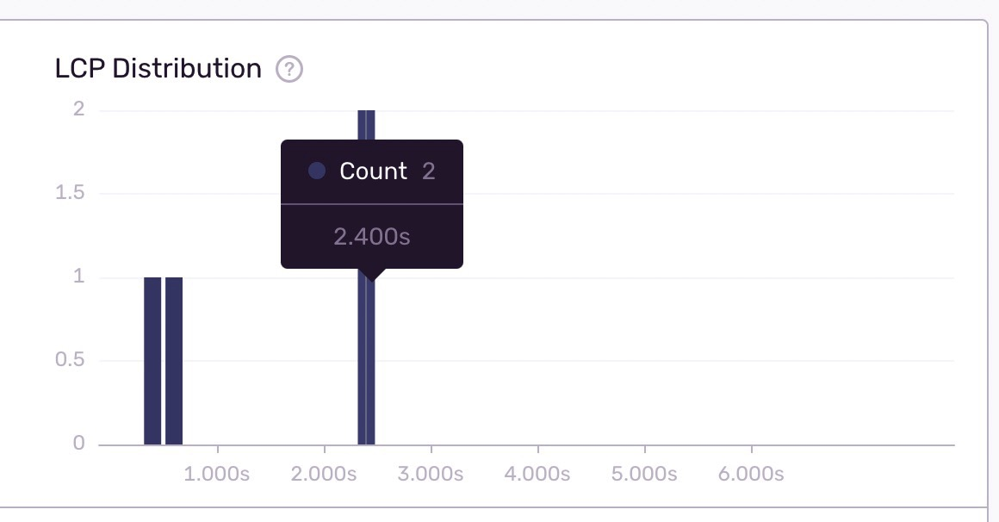

# Sentry 实战

## 面包屑 Breadcrumbs

在错误详情页中，有 `Breadcrumbs` 信息，它非常有用，可以追踪错误发生之前的一些事件，例如点击、页面导航等。

- `Breadcrumbs` 是一连串的事件跟踪，展示了发生问题之前的一系列操作。这些事件与传统日志非常相似，但可以记录更丰富的结构化数据。[Breadcrumbs 官方文档](https://docs.sentry.io/platforms/javascript/enriching-events/breadcrumbs/)

- 我们在 `Sentry` 管理界面，点击开之前的一个 `issue` 详情，可以看到 `Breadcrumbs` 相关信息：

  

- 最后一行记录了发生的错误，而在此之前的前面两行记录了在这个错误发生之前的一些操作：先发生了一次**页面加载**的**事务**，接着在点击了 `body > div#root > button` 的UI。

- 面包屑可以通过两种方式生成：

  1. 自动生成: 通过 `SDK` 及其相关的集成将自动记录多种类型的面包屑。例如，浏览器 `JavaScript SDK` 将自动记录 `DOM` 元素上的点击和按键、`XHR` 请求、控制台 `API` 调用以及所有导航变更。
  2. 手动生成: [官方文档](https://getsentry.github.io/sentry-javascript/modules/minimal.html#addbreadcrumb)

    ```js
    Sentry.addBreadcrumb({
      category: "auth",
      message: "Authenticated user " + user.email,
      level: Sentry.Severity.Info,
    });
    ```

## `Traces`, `Transactions` 和 `Spans`

- 上面 `Breadcrumbs` 中第一行，被称为 `Transaction` ，我们先点击开这个连接，进入这个 `Transaction` 详情页

- 可以看到原来这是一个页面加载的过程的记录

  

- 这个页面加载的整个过程，被称为一个`Transaction`

- 这个`Transaction`是一个树状结构，根节点是`pageload`，表示页面加载，根节点下有浏览器的缓存读取、DNS解析、请求、响应、卸载事件、dom内容加载事件等过程，还有各种资源加载过程

- 点击开任意一个节点，可以看到：

  - 每个节点都有一个`id`: `Span ID`
  - `Trace ID`: 追踪Id
  - 这个节点过程花费的时间等信息

- `Sentry` 把这些树状结构的节点称为 `Span`，他们归属于某一个 `Transaction`

- 一般来讲，页面加载是一个 `Transaction`，后端API接口逻辑是一个 `Transaction`，操作数据库逻辑是一个 `Transaction`，它们共同组成了一个 `Trace`





- [相关官方文档](https://docs.sentry.io/product/sentry-basics/tracing/distributed-tracing/)

## 页面加载

### 页面加载与性能指标

- 在上面的分析中，我们看到了一个页面加载（指刷新页面，不是单页面应用的路由变化）的 `Transaction`，如果我们在 `SDK` 的`Sentry.init()`中，将 `new Integrations.BrowserTracing()` 去掉，那么 `Breadcrumbs` 不会显示 `pageload` 信息：

  

- 所以 `SDK` 的 `BrowserTracing` 功能，就是用来将浏览器页面加载/导航操作检测为事务，并捕获请求、指标和错误作为跨度。

- 在页面加载的 `Transaction` 中，我们可以看到页面加过程中不同阶段的所花费的时间，例如 `FCP`、`FP`、`LCP`、`FID`等重要的性能指标信息

- 同一个 `url` 下会收集每一次上报的页面加载 `Transaction`

- 在 `Sentry管理界面 -> Performance菜单` 页中，可以查看每个 `url` 下收集的综合性能指标信息

  

  - `TPM`: 平均每分钟事务数
  - `FCP`: (First Contentful Paint) 首次内容绘制，标记浏览器渲染来自 DOM 第一位内容的时间点，该内容可能是文本、图像、SVG 甚至 元素.
  - `LCP`: (Largest Contentful Paint) 最大内容渲染，代表在viewport中最大的页面元素加载的时间. LCP的数据会通过PerformanceEntry对象记录, 每次出现更大的内容渲染, 则会产生一个新的PerformanceEntry对象
  - `FID`: (First Input Delay) 首次输入延迟，指标衡量的是从用户首次与您的网站进行交互（即当他们单击链接，点击按钮等）到浏览器实际能够访问之间的时间
  - `CLS`: (Cumulative Layout Shift) 累积布局偏移，总结起来就是一个元素初始时和其hidden之间的任何时间如果元素偏移了, 则会被计算进去, 具体的计算方法可看这篇文章 [https://web.dev/cls/](https://web.dev/cls/)
  - `FP`: First Paint (FP) 首次绘制，测量第一个像素出现在视口中所花费的时间，呈现与先前显示内容相比的任何视觉变化。这可以是来自文档对象模型 (DOM) 的任何形式，例如 background color 、canvas 或 image。FP 可帮助开发人员了解渲染页面是否发生了任何意外。
  - `TTFB`: Time To First Byte (TTFB) 首字节时间，测量用户浏览器接收页面内容的第一个字节所需的时间。TTFB 帮助开发人员了解他们的缓慢是由初始响应(initial response)引起的还是由于渲染阻塞内容(render-blocking content)引起的
  - `USERS`: UV数
  - `USER MISERY`: 对响应时间难以容忍度的用户数，`User Misery` 是一个用户加权的性能指标，用于评估应用程序性能的相对大小。虽然可以使用 `Apdex` 检查各种响应时间阈值级别的比率，但 User Misery 会根据满意响应时间阈值 (ms) 的四倍计算感到失望的唯一用户数。User Misery 突出显示对用户影响最大的事务。可以使用自定义阈值为每个项目设置令人满意的阈值。阈值设置在`Settings -> sentry -> cra-test -> Performance`

- [参考1](https://blog.csdn.net/c_kite/article/details/104237256)
- [参考2](https://cloud.tencent.com/developer/article/1878538?from=article.detail.1878539)
- [参考3](https://docs.sentry.io/product/performance/web-vitals/)

### `Performance` 面板



在 `Performance` 面板中，可以根据一些条件查询某一批 `Transaction`的：

#### 1. `FCP`、`LCP`、`FID`、`CLS`等信息

- 图片中筛选出了27个 `transaction`

  

- `FCP`、`LCP`、`FID`、`CLS`卡片中展示了27个 `transaction` 的平均值

  

- 每个卡片上还有绿色、黄色、红色的百分比，分别表示好、一般和差，通过该性能指标的阈值作区分

  

  - `sentry` 性能指标阈值定义

    | Web Vital | Good(绿色) | Meh(黄色) | Poor(红色) |
    | -- | -- | -- | -- |
    | 最大内容绘制 (LCP) | <= 2.5s | <= 4s | > 4s |
    | 首次输入延迟 (FID) | <= 100ms | <= 300ms | > 300ms |
    | 累积布局偏移 (CLS) | <= 0.11s | <= 0.25 | > 0.25 |
    | 首次绘制 (FP)      | <= 1s | <= 3s | > 3s |
    | 最大内容绘制 (LCP) | <= 0.1s | <= 3s | > 3s |
    | 首字节时间 (TTFB)  | <= 100ms | <= 200ms | > 600ms |

  - [官方文档](https://docs.sentry.io/product/performance/web-vitals/)

#### 2. `LCP p75面积图`、`LCP Distribution数量柱状图`、`TPM面积图`

- `LCP p75面积图`: `p50`、`p75`、`p95`都对应一个时间长度的值(例如 `277.20ms`)，表示在某一段时间内(例如`2021-10-19 2:35 PM` 到 `2021-10-19 2:40 PM`)，采集的所有`transaction`中(例如采集到了11个 `transaction`)，超过`25%`的 `transaction` 样本的`LCP`值超过了`277.20ms`。[官方文档](https://docs.sentry.io/product/performance/metrics/)

  

- `LCP Distribution数量柱状图`: 横坐标是LCP时间(单位s)，纵坐标是数量(单位个)。一个柱子，表示某个LCP时间的 `transaction` 数量

  

- `TPM面积图`: 平均每分钟的 `transaction` 数量。例如，在 `4:00 PM` 到 `8:00 PM`时间段内，平均每分钟的 `transaction` 数量是0.213个

  

#### 3. 某个url路径下的性能信息表格

我们应该已经可以读懂表格中的信息的含义了，接下来点开某个url维度下的详情页，还需要介绍两个指标 `Apdex` 和 `Failure Rate`

  

##### Apdex
  
`Apdex` 是一种行业标准指标，用于根据应用程序响应时间(`response time`)跟踪和衡量用户满意度(`satisfaction`)`。Apdex` 分数提供特定 `transaction` 或端点中满意(`satisfactory`)、可容忍(`tolerable`)和失败(`frustrated`)请求的比率。该指标提供了一个标准来比较 `transaction` 性能，了解哪些可能需要额外优化或排查，并为性能设定目标。[官方文档](https://docs.sentry.io/product/performance/metrics/#apdex)

- 以下是 Apdex 的组成部分及其公式：

  - `T`：目标响应时间的阈值。
  - `Satisfactory(满意度)`：当页面加载时间小于或等于 T 时，用户对使用该应用感到满意。
  - `Tolerable(可容忍度)`：当页面加载时间在 T 到 4T 之间时，用户认为该应用程序可以容忍使用。
  - `Frustrated(失败)`：当用户的页面加载时间大于 4T 时，他们对应用程序感到失望。
  - `Apdex`：(满意请求数 +（可容忍请求数/2））/（总请求数）

- 在 `sentry管理界面 -> Performance` 页面中可以为每个项目设置自定义阈值

##### Failure Rate 失败率

`failure_rate()` 表示不成功 `transaction` 的百分比。`Sentry` 将状态为 `“ok”`、`“canceled”` 和 `“unknown”` 以外的 `transaction` 视为失败。更多状态可以参考 [文档](https://develop.sentry.dev/sdk/event-payloads/span/)。

#### 4. 如何现在就产生Good(绿色)、Meh(黄色)、Poor(红色)的数据

很简单，在`Chrome dev tools`的`Network`中，将模拟网速调整为`fast 3G`、`slow 3G`，然后刷新几次页面即可。
