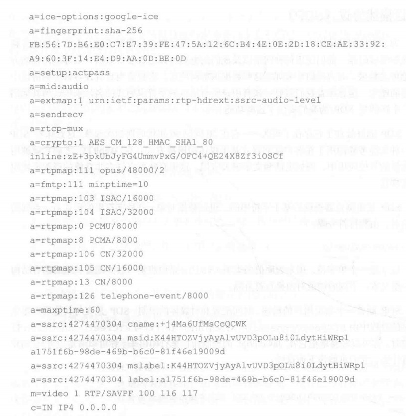
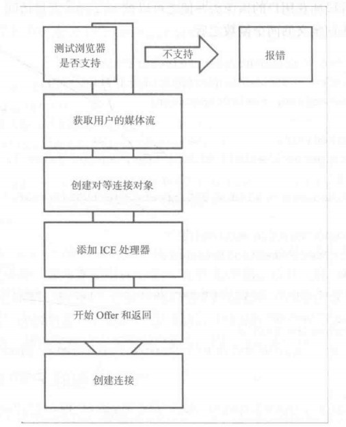

## webRTC实战2-创建简单的视频聊天应用

本章内容

- 理解UDP传输协议和实时传输
- 在本地与其它用户发送信令和交涉
- 在web上找到其它用户和NAT穿透
- 创建RTCPeerConnection

### 1.为什么使用UDP作为传输协议

- 先明确使用TCP传输也是可以的, 之后会学习到Traversal Using Relays around NAT(TURN)服务器
以及如何使用TCP进行传输
- 而更多场景使用UDP的原因是: 用户并不会对视频中的所有帧有感知, 比如30帧/s, 即使丢了2帧, 
用户也能联想到对应的发生的事情; 且UDP的开销小

### 2.基础概念介绍

- RTCPeerConnection对象: 用于初始化连接、传输信息、与其它用户建立UDP连接[找对方ip等]

```
var conn = new RTCPeerConnection(config)
conn.onaddstream = function(stream) {
    // --snip--
}
```

- 信号传递和交涉 (其实就是类似微信通话)
    - 为一个对等连接创建潜在的候选列表
    - 用户/计算机选择一个用户进行连接
    - 信令层将通知那个用户有人想要连接它, 用户选择接受/拒绝
    - 当连接的请求被接受时, 第一个用户会被通知
    - 若接受, 第一个用户将初始化RTCPeerConnection
    - 双方将通过信令通道交换各自电脑的硬件和软件信息
    - 双方将通过信令通道交换各自电脑的位置信息
    - 用户之间的链接将成功或失败

- 会话描述协议(SDP)
    - 确定对方支持的音视频解码方式、使用的网络、电脑能处理的数据量(将这些信息理解为一张名片, SDP就是这样的名片)
    - SDP是浏览器提供的基于字符串的二进制数据对象, 由`键值对+换行符`构成
    - 
    
- 在网络中找到一条清晰的线路连接对方,NAT-网络地址转换
    - NAT会话穿透工具(STUN) (应用场景: 大部分场景)
    - 使用中继技术床头NAT(TURN) (应用场景: 企业级的NAT中, 随机端口来连接数钱设备, 无法通过通用方法找到固定用户)
    - 交互式连接建立(ICE) (STUN + TURN来确定候选路径)
    
### 3.创建应用




    