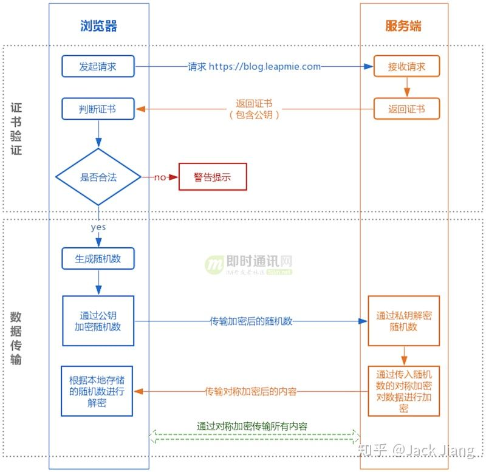
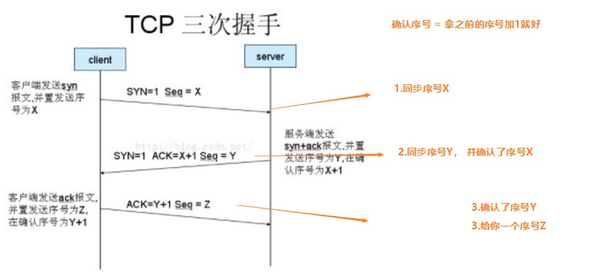
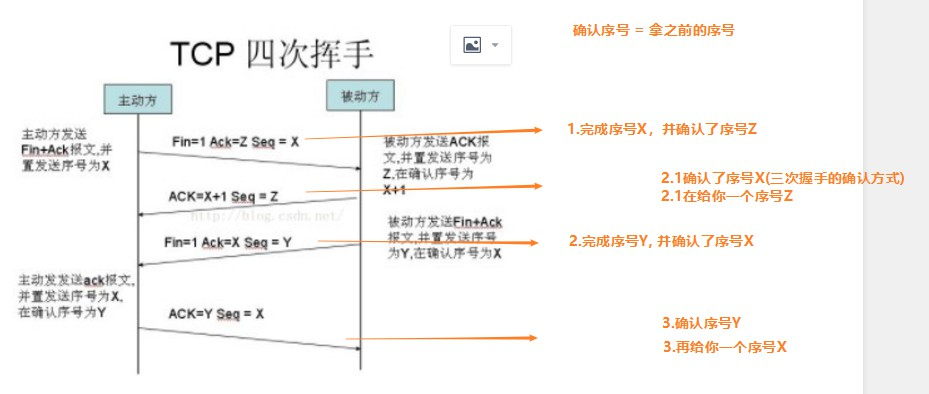
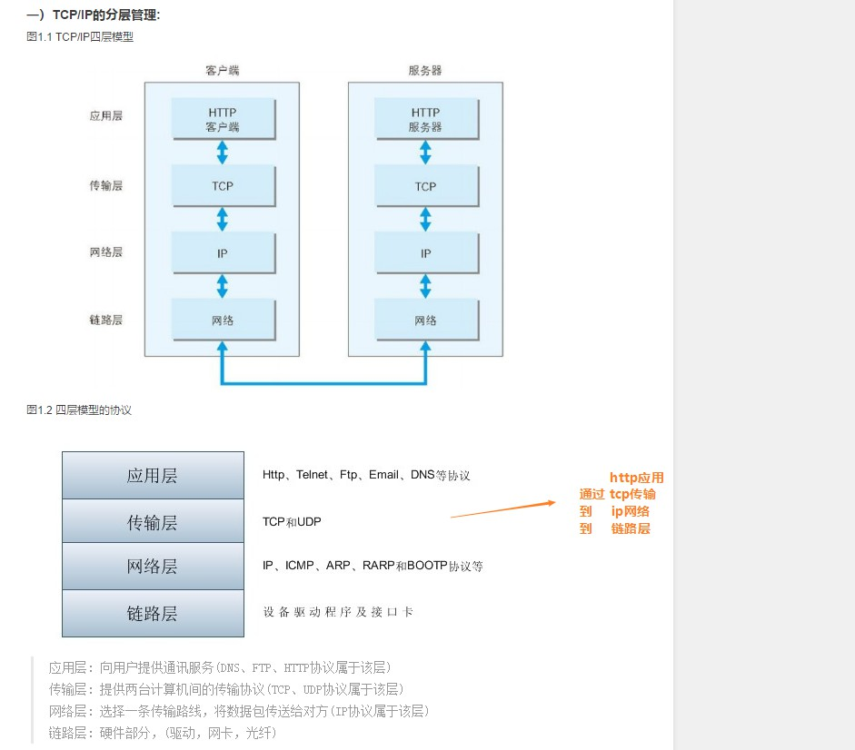
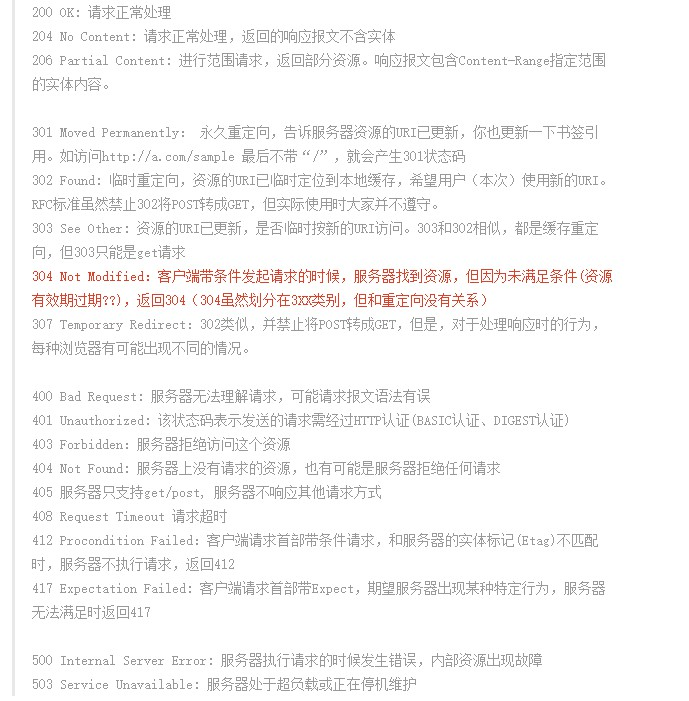
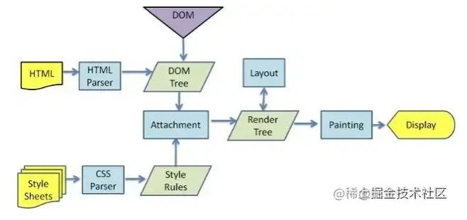
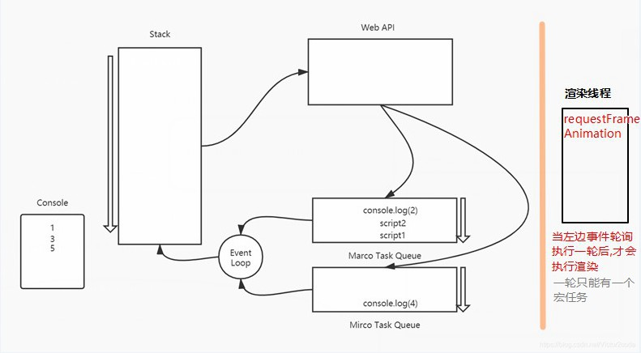

> https://juejin.cn/post/7016593221815910408#heading-11

## HTTP和HTTPS

### 1.http和https基础概念

http: 是一个客户端和服务端请求应答的标准(tcp), 用于服务器到本地浏览器的超文本传输

https: 在http的基础上加入了SSL层进行加密, 进行安全的通信

### 2.区别和优缺点

|      | http | https |
| :--- | :--- | :---- |
端口 | 80 | 443
安全性 | 安全性差, 明文传输 | 安全性强, 经过了SSL加密传输, 防止数据传输过程中的窃取,改变。和完整性
连接耗时 | 连接是简单,是无状态的 | https连接握手阶段比较费时, 加载时间和耗电都更多
费用 | 免费 | 需要ca证书, 费用较高

### 3.https协议的工作原理  (SSL的机制)



1. 客户端使用https请求服务器, 则要求服务器`建立SSL连接`
2. 服务器`返回证书(包含公钥)给客户端`
3. 验证证书 &nbsp;&nbsp; [浏览器开发商发布的时候会把ca证书签名公钥植入到浏览器]
4. `取一个超大的素数使用服务器证书公钥加密`, 并传送给网站 &nbsp;&nbsp;  [开始求离散对数]
5. `web网站`通过密钥解密出 `会话密钥`
6. `web网站`开始使用`会话密钥和客户端通信`

## 三次握手

> SYN: synchronize，同步，TCP连接的第一个包，非常小的一种数据包  
> ACK: ACKnowledge，承认  
> Seq: sequence，序列  



## 四次挥手



## TCP/IP / 如何保证数据包传输的有序可靠？

对字节流分段并进行编号, 然后通过`ack回复`和`超时重发`机制来保证

发送方, 每发送一段数据都不会立即删除, 确认对方收到(对方会发来累计应打包), 再从缓存区删除

## TCP和UDP的区别

|      | TCP | UDP |
| :--- | :--- | :--- |
可靠性 | 可靠 | 不可靠
传输速率 | 慢 | 报文头部更小, 传输更快
场景 | 正常请求 | websocket
传输方式 | 1对1 | 1对多

## HTTP 请求跨域问题

### 1.跨域的原理

- `跨域`，是指浏览器不能执行其他网站的脚本。它是由浏览器的`同源策略`造成的。
- `同源策略`,是浏览器对 JavaScript 实施的安全限制，只要`协议`、`域名`、`端口`有任何一个不同，都被当作是不同的域。
- `跨域原理`，即是通过各种方式，避开浏览器的安全限制。

### 2.解决方案

- JSONP  

    ajax 请求受同源策略影响，不允许进行跨域请求，
    而 script 标签 src 属性中的链接却可以访问跨域的 js 脚本，
    利用这个特性，服务端不再返回 JSON 格式的数据，
    而是 返回一段调用某个函数的 js 代码，在 src 中进行了调用，这样实现了跨域。

    ```
    //动态创建 script
    var script = document.createElement('script');
    
    // 设置回调函数
    function getData(data) {
        console.log(data);
    }
    
    //设置 script 的 src 属性，并设置请求地址
    script.src = 'http://localhost:3000/?callback=getData';
    
    // 让 script 生效
    document.body.appendChild(script);
    ```

- Nginx配置跨域  
- 本地开发使用proxy

## 四层模型



## HTTP常见状态码

#### 200 请求正常
#### 300 重定向
#### 400 请求失败
#### 500 服务器错误



## Cookie、Session、jwt、sessionStorage、localStorage 的区别

Cookie:  
- 服务器将信息存储到浏览器, 大小4K
- 如果不配置存活时间, 关闭浏览器就会销毁
- 不安全, 所以产生了session

Session:  
- 相当于信息都存在服务器
- 客户端只存对应session的key
- 还是不完善, 如果宕机, Session就被清空了
- 适合场景: SSR鉴权

jwt(JSON WEB TOKEN):  
- 生成令牌的数据不要太多，一般情况下用用户的id就可以了, 每个公司不一样
- 通过令牌识别身份
- 主流方案都是token
- token可以在url、header、请求体

sessionStorage:  
- 浏览器关闭时清空

localStorage:
- 永久存储
- 以前百度就用localStore来存页面, 但现在都是SSR

## 粘包问题分析与对策

通俗: 同一时刻向服务器发送N个包, 由于太多, 底层出于优化把包弄成一个, 一次性发送

官方: TCP粘包是指发送方发送的若干包数据到接收方接收时粘成一包，从接收缓冲区看，后一包数据的头紧接着前一包数据的尾。

### 出现原因:

简单得说，在流传输中出现，UDP不会出现粘包，因为它有消息边界

粘包情况有两种，一种是粘在一起的包都是完整的数据包，另一种情况是粘在一起的包有不完整的包。

为了避免粘包现象，可采取以下几种措施：

1) 配置`tcp强制立即传输指令push`, 不再等待缓存区满

2) 接收方引起的粘包, 优化程序设计, 提高`接收进程的优先级`

3) 接收方按包的数据结构字段, 人为控制多次接收, 然后合并, 来避免粘包

&nbsp;

&nbsp;

&nbsp;

## 浏览器

### 1.从输入URL到页面加载的全过程

1. 浏览器输入URL
2. 查找缓存, 看看之前是否缓存过该页面, 有的话显示内容
3. DNS解析(浏览器缓存 -> 系统缓存 -> 路由缓存 -> 域名解析服务器找)
4. 建立TCP连接, 默认服务器80端口
5. 发起HTTP请求, 请求报文会在TCP三次握手的第三次放数据给服务器
6. 服务器接收到请求后返回html文件给浏览器
7. 关闭tcp连接

8. 浏览器渲染, 客户端拿到HTML后需要渲染出来  
 
 - 构建DOM树、CSS树
 - 构建Render树(根据DOM树和CSS树)
 - 布局(Layout): 计算每个节点在屏幕的位置
 - 绘制(Painting): 遍历render树, 绘制节点
 
 
 
 - JS引擎解析过程, 调用JS引擎执行JS代码
    - 创建window对象 (执行上下文)
    - 加载js文件
    - 编译js文件, 对全局变量和函数进行变量提升
    
### 2.1.浏览器重排与重绘区别

- 重排: 元素`几何信息`发生改变(如位置), 就会引起`重排`
- 重绘: `几何信息`没变, `形状变化`, 就会引起`重绘`

『重排』必然出现『重绘』, 『重绘』不一定出现『重排』

### 2.2.如何避免重排重绘

1. 集中修改样式, 不要一条条修改
2. 使用position: absoult、fixed 不会触发`重排`
3. GPU加速, translate使用3D变化

### 3.浏览器的缓存机制 强制缓存 && 协商缓存

- 强制缓存:　服务器响应头返回 `Expires` 和 `Cache-Control`, 会进行强制缓存
- 强制缓存分三种情况, 如下:
    - 存在缓存结果和标识, 未失效, 直接返回结果
    - 存在缓存结果和标识, 已失效, 走协商缓存
    - 不存在存在缓存结果和标识, 正常请求
    
- 协商缓存: 就是强制缓存失效后，浏览器携带缓存标识向服务器发起请求，由服务器根据缓存标识决定是否使用缓存的过程
, 控制协商缓存的字段分别有：`Last-Modified / If-Modified-Since` 和` Etag /If-None-Match`，其中`Etag/If-None-Match`的优先级比`Last-Modified/If-Modified-Since`高。
- 协商缓存分两种情况, 如下:
    - 协商缓存生效，返回304
    - 协商缓存失效，返回200和请求结果结果

// Etag由`长度 + 时间戳`生成

### 4.说下进程、线程和协程

- 线程: `程序执行的最小单元`，是`处理器`调度的基本单位。
一个标准的线程由线程ID、指针、寄存器、堆栈组成

- 进程: `应用程序`运行的载体, `操作系统`进行资源分配和调度的基本单位。
一个进程可以有多个线程

- 协程: 基于线程纸上, 但比线程更轻量级, 是由程序员写程序来管理的轻量级线程,
又叫`用户空间线程`

区别: 

|      | 进程  | 线程 |
| :--- | :--- | :--- |
拥有资源 | 进程是拥有资源的独立单位 | 线程不拥有资源,但能访问隶属进程的资源
调用 | 进程作为系统有用资源的基本单位 | 线程作为处理器调度和分配的基本单位
系统开销 | 大 | 小


## HTML && CSS

### 1.h5新特性

语义化标签: `header` `nav` `main` `article` `section` `aside` `footer`

### 2.css选择器及优先级

##### 选择器

- id选择器(#myid)
- 类选择器(.myclass)
- 属性选择器(a[rel="external"])
- 伪类选择器(a:hover, li:nth-child)
- 标签选择器(div, h1,p)
- 相邻选择器（h1 + p）
- 子选择器(ul > li)
- 后代选择器(li a)
- 通配符选择器(*)

##### 优先级

- !important
- 内联样式（1000）
- ID选择器（0100）
- 类选择器/属性选择器/伪类选择器（0010）
- 元素选择器/伪元素选择器（0001）
- 关系选择器/通配符选择器（0000）

### 3.box-sizing属性

box-sizing: content-box/border-box/inherit

`content-box`: 宽度和高度分别应用到元素的内容框，在宽度和高度之外绘制元素的内边距和边框。【标准盒子模型】
`border-box`: 为元素设定的宽度和高度决定了元素的边框盒。【IE 盒子模型】
`inherit`: 继承父元素的 box-sizing 值。


`标准盒模型`: 一个块的总宽度 = width+margin(左右)+padding(左右)+border(左右)
`怪异盒模型`: 一个块的总宽度 = width+margin（左右）（既 width = width + padding + border ）

### 4.BFC（块级格式上下文）

BFC是CSS布局的一个概念，是一个独立的渲染区域，规定了内部box如何布局， 
并且这个区域的子元素不会影响到外面的元素

**如何创建BFC？**

- 根元素，即HTML元素
- float的值不为none
- position为absolute或fixed
- display的值为inline-block、table-cell、table-caption
- overflow的值不为visible

### 5.隐藏页面中某个元素的方法

1. `opacity：0`，该元素隐藏起来了，但不会改变页面布局，并且，
如果该元素已经绑定 一些事件，如click 事件，那么点击该区域，也能触发点击事件的

2. `visibility：hidden`，该元素隐藏起来了，但不会改变页面布局，
但是不会触发该元素已 经绑定的事件 ，隐藏对应元素，在文档布局中仍保留原来的空间（重绘）

3. `display：none`，把元素隐藏起来，并且会改变页面布局，可以理解成在页面中把该元素。 
不显示对应的元素，在文档布局中不再分配空间（回流+重绘）

### 5.清除浮动

css

```
clearfix:after {
    content: '';
    display: block;
    width: 0;
    height: 0
    clear: both
    visibility: hidden;
}
```

sass

```
@mixin clearfix(){
    &:after{
        display: block;
        content: "";
        clear: both;
    }
}
.box{
    @include clearfix;
}
```

### 6.兼容不同分辨率

```
$oneRem: 50px !default;
$designWidth: 360px !default; //设计稿宽度
$designHeight: 618px !default; // 设计稿高度

@function pxToRem($px) {
  @return $px/$oneRem*1rem
}

@function pxToVw($px) {
  @return ($px/$designWidth)*100*1vw
}

@function pxToVh($px) {
  @return ($px/$designHeight)*100*1vh
}
```

&nbsp;

&nbsp;

&nbsp;

## JS、ES6

### 1.8种数据类型

- number
- string
- boolean
- undefined
- null
- symbol

- function
- object (Array/Date/RegExp/)

### 2.类型检测方案

- typeof
- instanceof
- Object.prototype.toString.call

### 3.var、let、const

var
- 没有块的概念
- 有变量提升

let
- 有快的概念
- 没有变量提升
- 不能重名

const
- 定义常量

### 4.js垃圾回收机制

使用的是浏览器的自动垃圾回收机制

- `标记清除`:在js中，最常用的垃圾回收机制是标记清除：当变量进入执行环境时，
被标记为“进入环境”，当变量离开执行环境时，会被标记为“离开环境”。
垃圾回收器会销毁那些带标记的值并回收它们所占用的内存空间。

-` 谷歌浏览器`：“查找引用”，浏览器不定时去查找当前内存的引用，
如果没有被占用了，浏览器会回收它；如果被占用，就不能回收。

- `IE浏览器`：“引用计数法”，当前内存被占用一次，计数累加1次，
移除占用就减1，减到0时，浏览器就回收它。

优化手段: 减少闭包, 不使用的变量置为null

### 5.作用域和作用域链

- `作用域`: 当前函数所处的上下文称为`函数作用域`, 对应window的为`全局作用域`
- `作用域链`: 顺着函数往上层作用域查找, 就会形成作用域链

### 6.执行上下文

当控制器转到可执行代码的时候，就会进入一个执行上下文。
执行上下文可以理解为当前代码的执行环境，包含: 变量对象(其实就是变量提升组合成的变量)，作用域链，this指针

在执行代码的时候不断压栈的过程就是执行上下文, 具体的看有道云笔记

### 7.闭包

定义: 内部函数使用了外部函数的变量

好处: 1.将一些变量隐藏起来, 放在函数内不对外暴露

坏处: 1.内存消耗大, 在IE中可能导致内存泄露

场景: 
1. 节流防抖
2. 高阶函数的柯里化
3. vue的计算属性传参
4. 发送ajax请求成功|失败的回调
5. setTimeout的延时回调

使用优化: 
1. 将不必要的变量置为null

### 8.this的五中情况

1. 作为普通函数执行时，this指向window。
2. 当函数作为对象的方法被调用时，this就会指向该对象。
3. 构造器调用，this指向实例对象。
4. 箭头函数 箭头函数的this绑定看的是this所在函数定义在哪个对象下，
就绑定哪个对象。如果有嵌套的情况，则this绑定到最近的一层对象上。
5. 基于Function.prototype上的 apply 、 call 和 bind 调用模式，
这三个方法都可以显示的指定调用函数的 this 指向。apply接收参数的是数组，
call接受参数列表，`` bind方法通过传入一个对象，
返回一个 this 绑定了传入对象的新函数。这个函数的 this指向除了使用new `时会被改变，
其他情况下都不会改变。若为空默认是指向全局对象window。

### 9.原型和原型链

- 每个 class都有显示原型 prototype
- 每个实例都有隐式原型 _ proto_
- 实例的_ proto_指向对应 class 的 prototype

‌ 原型:  在 JS 中，每当定义一个对象（函数也是对象）时，
对象中都会包含一些预定义的属性。其中每个函数对象都有一个prototype 
属性，这个属性指向函数的`原型对象`。

### 10.new运算符的实现机制

1. 首先创建了一个新的空对象
2. 设置原型，将对象的原型设置为函数的prototype对象。
3. 让函数的this指向这个对象，执行构造函数的代码（为这个新对象添加属性）
4. 判断函数的返回值类型，如果是值类型，返回创建的对象。如果是引用类型，就返回这个引用类型的对象。

### 11.事件循环

 

> 宏任务大概包括：setTimeout， setInterval， 
>setImmediate【IE的】，script，Ajax，I/O 【读写文件、点击事件】
> 微任务大概包括：process.nextTick， queueMircotask
>Promises【准确来说是promise.then,new Promise时候是同步代码】， 
>MutationObserver、

### 11.promise/generate/async和await的区别

- Promise的原理是: 执行resolve/reject的时候执行队列

- Generator的原理是: 转换成一个while+switch case函数, 然后逐个拿值
     - https://blog.csdn.net/hj7jay/article/details/53905868
- co的原理是: 构建一个Generator的自动运行器(利用promise解决每一次Generator yield的异步操作)
     - koa、express都是基于co实现异步
     
- async await的原理是: 其实就是co的语法糖(也可以叫generator的语法糖)

### 12.MVVM

视图模型双向绑定，是Model-View-ViewModel的缩写，
也就是把MVC中的Controller演变成ViewModel。

Model层代表数据模型，
View代表UI组件，
ViewModel是View和Model层的桥梁，

数据会绑定到viewModel层并自动将数据渲染到页面中，
视图变化的时候会通知viewModel层更新数据。
以前是操作DOM结构更新视图，现在是数据驱动视图

&nbsp;

&nbsp;

&nbsp;

## Vue

### 1.Vue底层原理

vue.js是采用数据劫持结合发布者-订阅者模式的方式，通过Object.defineProperty()来劫持
各个属性的setter和getter，在数据变动时发布消息给订阅者，触发相应的监听回调

Vue是一个典型的MVVM框架，模型（Model）只是普通的javascript对象，
修改它则试图（View）会自动更新。
这种设计让状态管理变得非常简单而直观

Observer（数据监听器） : Observer的核心是通过Object.defineProprtty()来监听数据的变动，
这个函数内部可以定义setter和getter，每当数据发生变化，就会触发setter。
这时候Observer就要通知订阅者，订阅者就是Watcher

Watcher（订阅者） : Watcher订阅者作为Observer和Compile之间通信的桥梁，主要做的事情是：
在自身实例化时往属性订阅器(dep)里面添加自己
自身必须有一个update()方法
待属性变动dep.notice()通知时，
能调用自身的update()方法，并触发Compile中绑定的回调

Compile（指令解析器） : Compile主要做的事情是解析模板指令，
将模板中变量替换成数据，然后初始化渲染页面视图，
并将每个指令对应的节点绑定更新函数，
添加鉴定数据的订阅者，一旦数据有变动，收到通知，更新试图

### 2.谈谈对vue生命周期的理解？

每个Vue实例在创建时都会经过一系列的初始化过程，vue的生命周期钩子
，就是说在达到某一阶段或条件时去触发的函数，目的就是为了完成一些动作或者事件

- create阶段：vue实例被创建  
    beforeCreate: 创建前，此时data和methods中的数据都还没有初始化  
    created： 创建完毕，data中有值，未挂载  
- mount阶段： vue实例被挂载到真实DOM节点  
    beforeMount：可以发起服务端请求，请求数据  
    mounted: 此时可以操作DOM  
- update阶段：当vue实例里面的data数据变化时，触发组件的重新渲染  
    beforeUpdate :更新前  
    updated：更新后  
- destroy阶段：vue实例被销毁  
    beforeDestroy：实例被销毁前，此时可以手动销毁一些方法  
    destroyed:销毁后  

### 3.组件中的data为什么是一个函数？

组件之间data隔离数据, 这样生成的data彼此独立

### 4.为什么v-for和v-if不建议用在一起

1.当 v-for 和 v-if 处于同一个节点时，v-for 的优先级比 v-if 更高，
这意味着 v-if 将分别重复运行于每个 v-for 循环中。
如果要遍历的数组很大，而真正要展示的数据很少时，这将造成很大的性能浪费
2.这种场景建议使用 computed，先对数据进行过滤

### 5.Vue 项目中 key 的作用

提高diff的速度, 更高效的更新虚拟DOM

vue中采用对比过程中采用tag和key来对比一个元素是否可以复用, 如果不添加key,
默认使用下标进行对比, 这时候就会有弊端, 如...

### 6.vue组件的通信方式

祖孙: provide和inject
爷孙: $listeners和$attrs
父子: $parent和$children / props
自己组件: $on和$emit
任意组件: $bus、vuex

### 7.nextTick的实现原理是什么？

```
在下次 DOM 更新循环结束之后执行延迟回调，在修改数据之后立即使用 
nextTick 来获取更新后的 DOM。 nextTick主要使用了宏任务和微任务。
 根据执行环境分别尝试采用Promise、MutationObserver、setImmediate，
如果以上都不行则采用setTimeout定义了一个异步方法，多次调用nextTick会将方法存入队列中，
通过这个异步方法清空当前队列。
```

### 8.使用过插槽么？用的是具名插槽还是匿名插槽或作用域插槽

vue中的插槽是一个非常好用的东西slot说白了就是一个占位的 
在vue当中插槽包含三种一种是默认插槽（匿名）一种是具名插槽还有一种就是作用域插槽 
匿名插槽就是没有名字的只要默认的都填到这里具名插槽指的是具有名字的

#### 匿名插槽:

子组件

```
<slot>bb</slot>
```

父组件

```
<Slot>aa</Slot>
```

// 最后aa会替换bb

#### 具名插槽:

子组件Header

```
<template>
    <slot name="xxx" />
    <p>我是子组件标题</p>
    <slot name="yyy" />
</template>
```

父组件

```
<Header title="你好">
    <div slot="xxx"> 左</div>
    <div slot="yyy"> 右</div>
</Header>
```

// 最后输出: 左 我是子组件标题 右

#### 作用域插槽:

子组件

```
// 把子组件的user数据传给父组件
<slot :data="user"></slot>
```

父组件

```
<child>
    <template slot-scope="scope"> 
        <p>{{scope.user}}xxx</p> 
    </template><
/child>
```

// elementui的写法

### 9.keep-alive的实现

原理：Vue.js内部将DOM节点抽象成了一个个的VNode节点，
keep-alive组件的缓存也是基于VNode节点的而不是直接存储DOM结构。
它将满足条件（pruneCache与pruneCache）的组件在cache对象中缓存起来，
在需要重新渲染的时候再将vnode节点从cache对象中取出并渲染。

### 10.mixin

```
mixin 项目变得复杂的时候，多个组件间有重复的逻辑就会用到mixin
多个组件有相同的逻辑，抽离出来
mixin并不是完美的解决方案，会有一些问题

劣势：
1.变量来源不明确，不利于阅读
2.多mixin可能会造成命名冲突 
3.mixin和组件可能出现多对多的关系，使得项目复杂度变高
```

### 11.Vuex的理解及使用场景


getter 的返回值会根据它的依赖被缓存起来， 且只有当它的依赖值发生了改变才会被重新计算,就像计算属性一样
Mutation：是唯一更改 store 中状态的方法，且必须是同步函数 
Action：用于提交 mutation，而不是直接变更状态，可以包含任意异步操作 
Module：允许将单一的 Store 拆分为多个 store 且同时保存在单一的状态树中


&nbsp;

&nbsp;

&nbsp;


## ASK
1. http的无状态是什么意思
- (即不会保存上一次请求的信息，随着web的发展，因无状态而导致业务变得棘手，如单点登录，于是引入了Cookie技术。)

2. https是长时间不断开?

4. 安全问题
HTTPS 在内容传输的加密上使用的是对称加密，非对称加密只作用在证书验证阶段

4.websocket的使用

5.axios的封装
6.vue2和vue3相关

7. ts
8. base64原理
9. 变量提升(看有道云)
11. 闭包

11.清除浮动

12.vue和react的区别

docker + k8s

项目中遇到的问题
