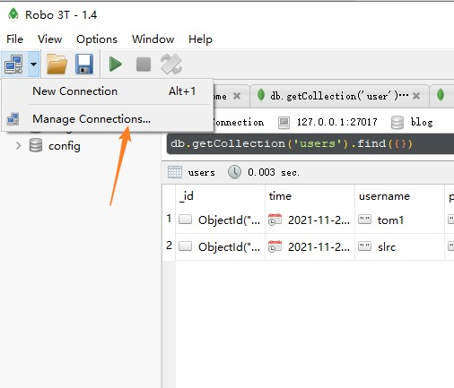
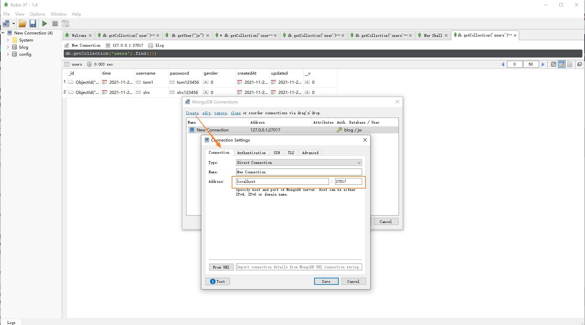
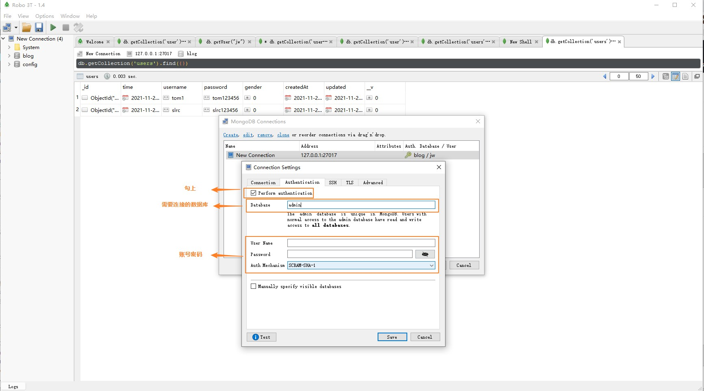
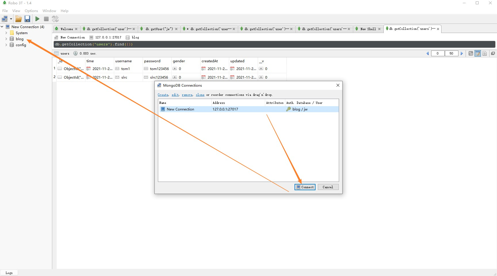

## 一.`MongoDB`简介 

`Mongodb`是一个`NoSQL`数据库，相比`MySQL`那样的关系型数据库，它更显得 轻巧、灵活，非常适合在数据规模很大、事务性不强的场合下使用。

- 适用场景(不重要且无关联的数据): 爬虫数据，存储视频播放到第几分钟

- 有关联重要的数据还是要使用mySQL

- 组成: MongoDB(数据库) -> Collection(集合) -> 文档

同时它也是一个对象数据库，没有表和行的概念，也没有固定的模式和结构，所有的数据都是以文档的形式存存储(文档，就是一个关联数组式的对象，它的内部由属性组成，一个属性对应的值可能是一个数、字符串、日期、数组、甚至是一个嵌套文档)，数据格式就是JSON。  

## 二.`MongoDB`安装

### 1.`Windows` 安装

- 关闭360等杀毒软件!!!
- [windows安装包下载](https://www.mongodb.com/try/download/community)
- `Install MongoDB as a Service` (开机自启动)
- `Install MongoDB Compass` 取消勾选，不安装自带的可视化工具
- 将可执行文件配置到环境变量中 `C:\Program Files\MongoDB\Server\4.4\bin`

默认就会运行`mongoDB`服务端

```bash
mongod.exe --config "C:\Program Files\MongoDB\Server\4.4\bin\mongod.cfg"
```

> 配置文件存放在`mongod.cfg`文件中

启动`mongo`客户端

```bash
mongo
```

> 此时已经可以正常链接到`mongo`服务

### 2.安装`Robo 3T`

- [下载Robomongo](https://robomongo.org/download)









### 3.`mac`安装

- [通过HomeBrew安装](https://github.com/mongodb/homebrew-brew)


## 三.`Mongo`数据库管理

### 1.创建超级管理员账户

```bash
mongo
show users // 显示当前数据库的用户

use admin   // 进入数据库admin
db.createUser({user:"jw",pwd:"123456",roles:[{role:'root',db:'admin'}]}); // 给admin数据库添加超级管理员权限用户
// db.createUser({user:"jw",pwd:"123456",roles:[{role:'dbOwner',db:'admin'}]}); // 给admin数据库添加拥有者权限用户
quit()
```

修改配置文件C:\Program Files\MongoDB\Server\4.4\bin\mongod.cfg

```
security:
  authorization: enabled
```

重启服务

> 启用权限，下次登录时需要通过权限登录

```bash
mongo
show dbs
use admin
db.auth('jw','123456')  // 验证账号

use blog    // 进入数据库blog
db.user.insert({name:'zf'}) // 往 集合user 中插入 文档{name:'zf'}
db.user.find({})
```

### 2.创建数据库管理员

```bash
use web
db.createUser({user:"webadmin",pwd:"123456",roles:[{role:'dbOwner',db:'web'}]})
```

> 登录某个数据库时可以采用具体的数据库管理员来登录

### 3.其他命令

```shell
db.dropUser('zf') // 删除用户
```

## 四.mongoose使用

[mongoose](http://www.mongoosejs.net/docs/guide.html) 是`node.js`中操作`MongoDB`常用到的`ORM`(Object Relational Mapping)框架。

让`NodeJS`操作`Mongodb`数据库变得更加灵活简单

- 通过关系型数据库的思想来设计非关系型数据库
- 基于`mongodb`驱动，简化操作（更方便，更灵活，更安全）

> 存储在`mongodb`集合中的每个文档都有一个默认的主键_id

