## 介绍mysql

### 1. 下载、安装

mysql下载: https://dev.mysql.com/downloads/mysql/  
workbench可视化下载: https://dev.mysql.com/downloads/workbench/

安裝mysql教程: http://c.biancheng.net/view/7135.html

woekbench连接数据库:

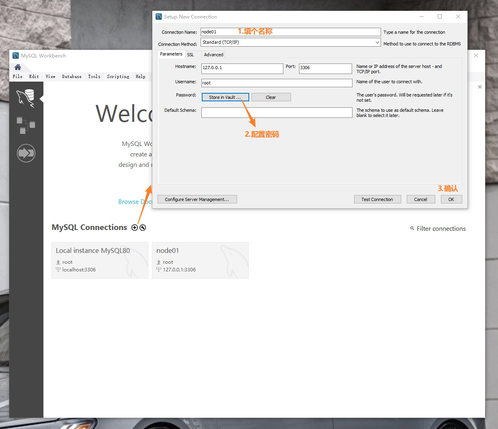

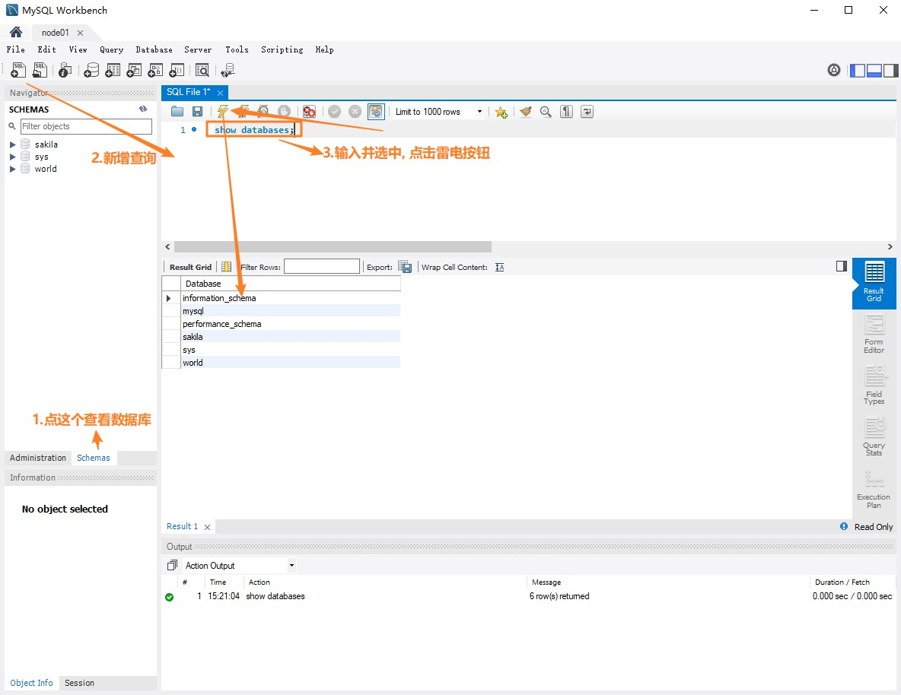

### 2. 建库

#### 2.1 图形化:

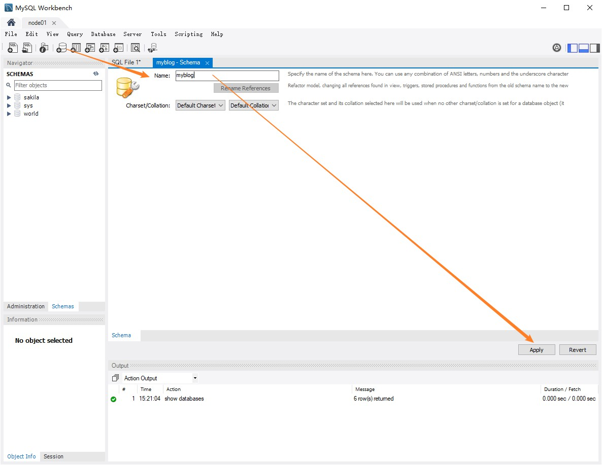

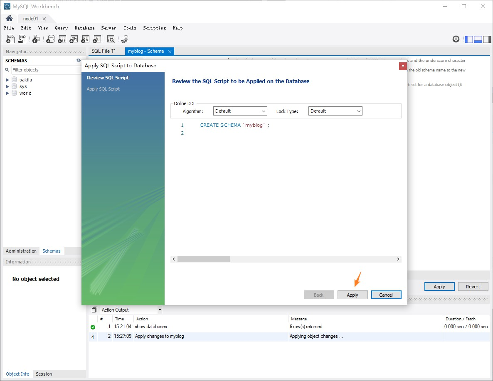

#### 2.2 命令:

```
CREATE SCHEMA `myblog` ;
```

### 3. 建表

#### 3.1 图形化:

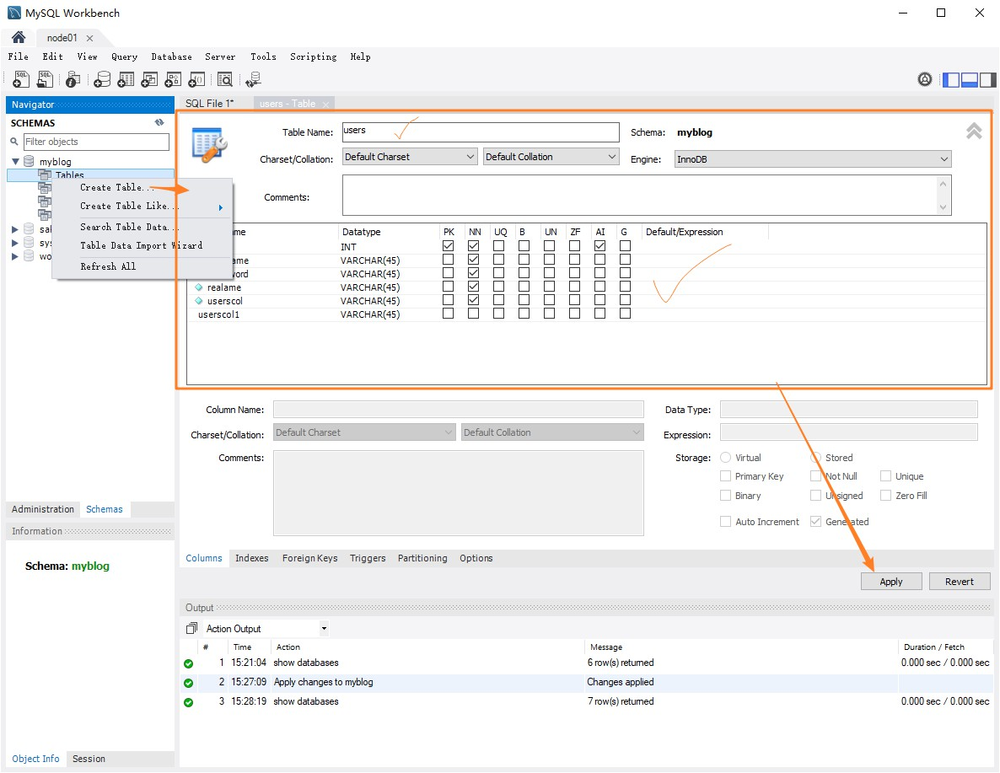

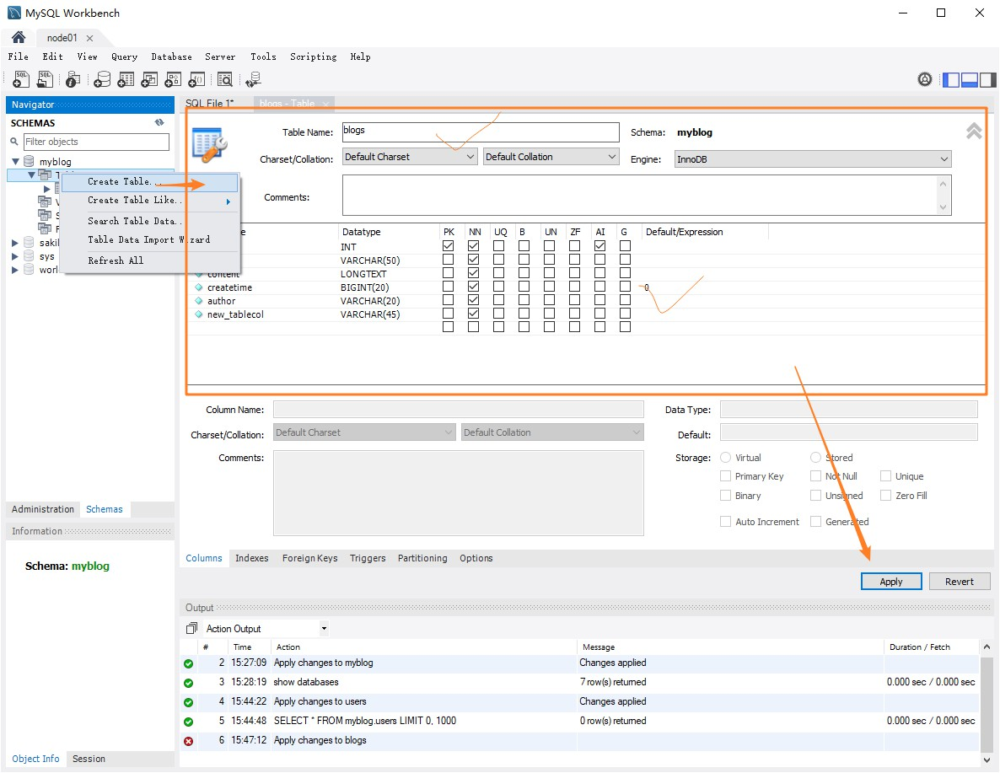

#### 3.2 命令:

```
CREATE TABLE `myblog`.`users` (
  `id` INT NOT NULL AUTO_INCREMENT,
  `username` VARCHAR(45) NOT NULL,
  `password` VARCHAR(45) NOT NULL,
  `realame` VARCHAR(45) NOT NULL,
  `userscol` VARCHAR(45) NOT NULL,
  PRIMARY KEY (`id`));

CREATE TABLE `myblog`.`blogs` (
  `id` INT NOT NULL AUTO_INCREMENT,
  `title` VARCHAR(50) NOT NULL,
  `content` LONGTEXT NOT NULL,
  `createtime` BIGINT(20) NOT NULL DEFAULT 0,
  `author` VARCHAR(20) NOT NULL,
  `new_tablecol` VARCHAR(45) NOT NULL,
  PRIMARY KEY (`id`));
```

#### 3.3 总结:

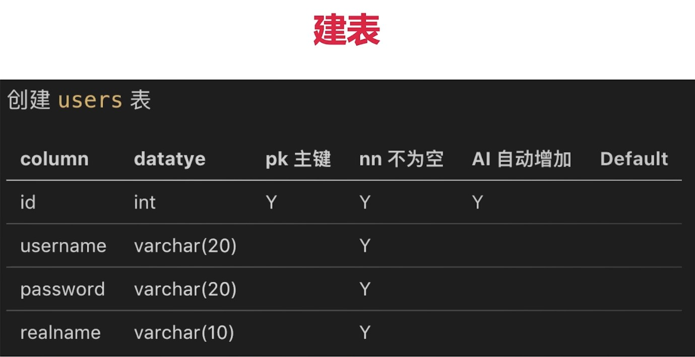

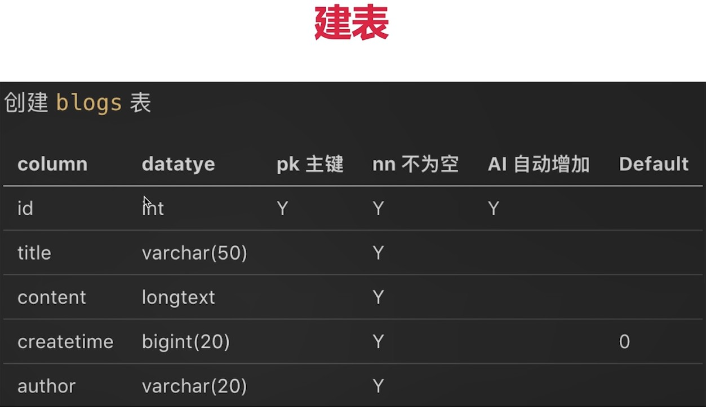

类型: `数字用int`, `超大数字用bigint(20)`, `字符串用varchar(20)`, `长文本用longtext`

### 4. 基本的sql语句

#### 4.1 增删改查

```
-- 使用数据库
use myblog;

-- 增
-- insert into users (username, `password`, realname) values ('lisi', '123', '李四');

-- 删(真删/软删)
-- delete from users where username = 'lisi';
-- update users set state = 1 where username = 'lisi'

-- 改
-- SET SQL_SAFE_UPDATES = 0
-- update users set realname='李四2' where username = 'lisi'

-- 查
-- select * from users;
-- select id, username from users;
-- select * from users where username = 'lisi' and `password` = '123';
-- select * from users where password like '%1%'
-- select * from users where password like '%1%' order by id desc; -- order表示排序、desc表示逆序
-- select * from users where state <> '0'; -- <>表示不等于
select count(id) as `count` from blogs -- 统计数量
select * from blogs order by id limit 2 -- 限制返回两条
select * from blogs order by id limit 2 offset 2 -- 第二页（每页两条）
```

注释: sql语句前加`--`

### 5. 外键&连表查询

#### 5.1 创建外键

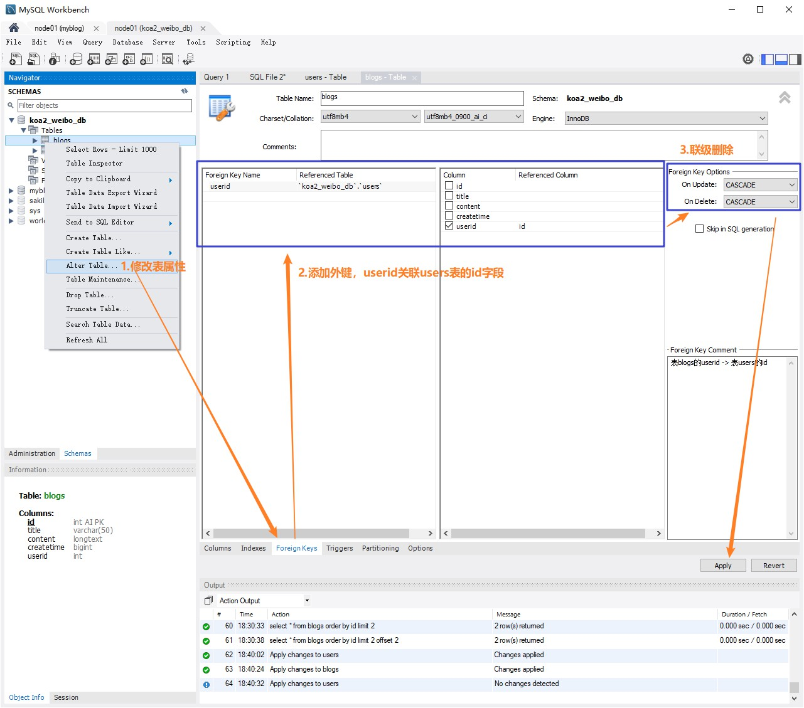

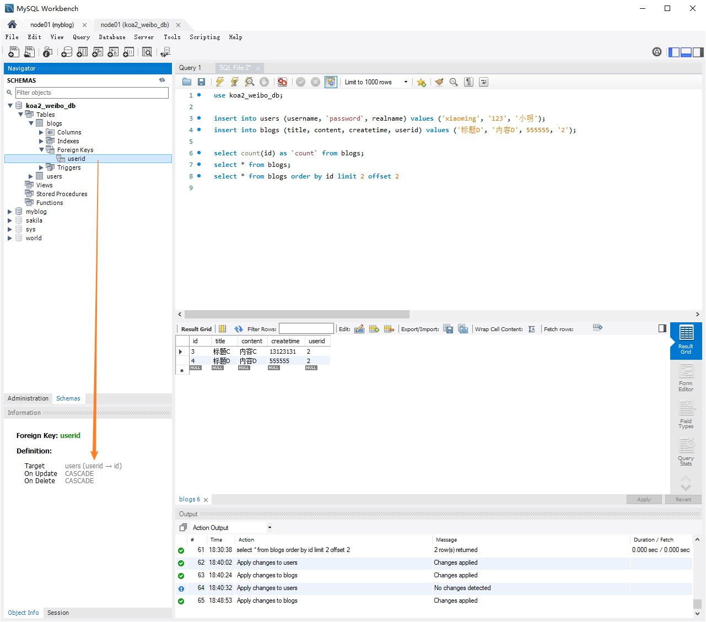

#### 5.2 更新限制 & 删除级联 (添加外键的效果)

```
// 更新限制
insert into blogs (title, content, createtime, userid) values ('标题F', '内容F', 111111111111, 4);

// 报错: Error Code: 1452. Cannot add or update a child row: a foreign key constraint fails (`koa2_weibo_db`.`blogs`, CONSTRAINT `userid` FOREIGN KEY (`userid`) REFERENCES `users` (`id`) ON DELETE CASCADE ON UPDATE CASCADE)
```
```
// 删除级联
delete from users where id = 4;

// 会自动删除级联blogs表相应数据
```

#### 5.3 连表查询

```
select * from blogs inner join users on users.id = blogs.userid;
select blogs.*, users.realname from blogs inner join users on users.id = blogs.userid;

select blogs.*, users.realname 
from blogs inner join users on users.id = blogs.userid
where users.realname = '小明';
```

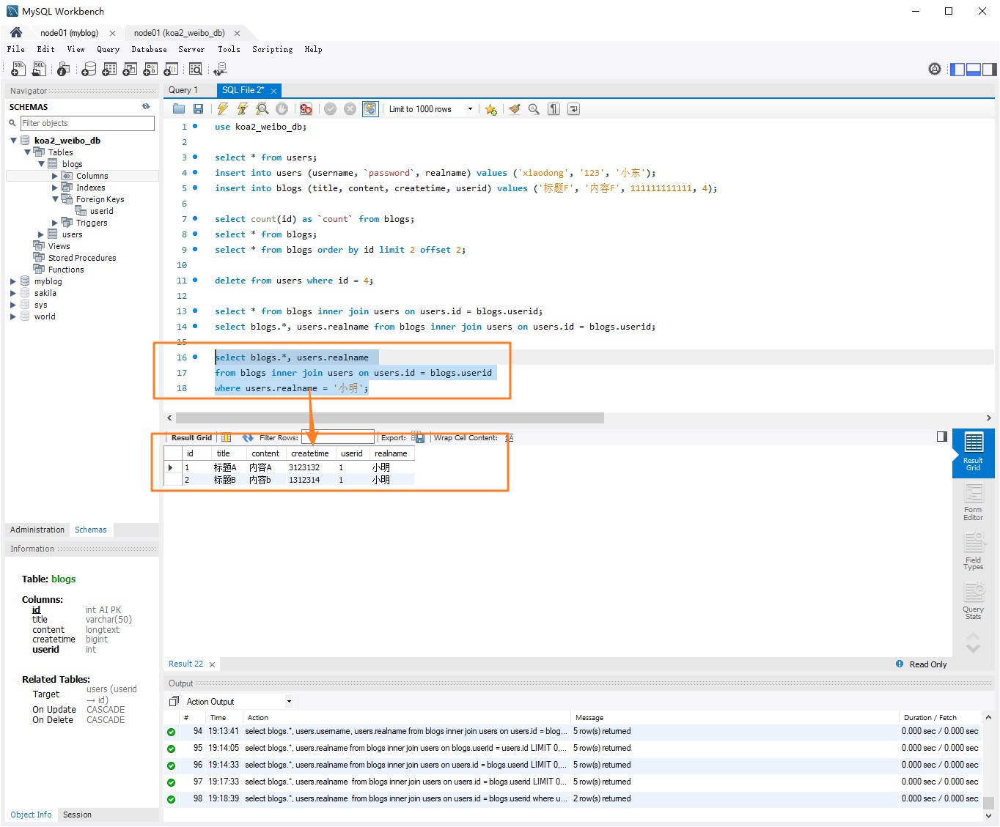

### 6. nodejs操作mysql

#### 6.1 示例: 用demo演示, 不考虑使用

新建文件夹
```
npm init -y
npm i mysql2
```

新建index.js
```
const mysql = require('mysql2')

const con = mysql.createConnection({
    host: 'localhost',
    port: '3306',
    user: 'root',
    password: 'root',
    database: 'myblog'
})

con.connect()

const sql = 'select * from users'
// const sql = `update users set realname = '李四2' where username = 'lisi'`
// const sql = `insert into users (username, \`password\`, realname) values ('xiaoming', '123', '小明');`

con.query(sql, (err, result) => {
    if (err) {
        console.log(err)
        return
    }
    console.log(result)
})

con.end()
```

运行即可操作数据库。

#### 6.2 将示例封装

src/conf/db.js

```
let MYSQL_CONFS = {
    dev: {
        host: 'localhost',
        port: '3306',
        user: 'root',
        password: 'root',
        database: 'myblog'
    },
    prd: {
        host: 'localhost',
        port: '3306',
        user: 'root',
        password: 'root',
        database: 'myblog'
    },
}

module.exports = {
    MYSQL_CONF: MYSQL_CONFS[process.env.NODE_ENV]
}
```

src/db/mysql.js

```
const mysql = require('mysql')
const {MYSQL_CONF} = require(../conf/db.js)

const mysql = require('mysql2')

const con = mysql.createConnection(MYSQL_CONF)
con.connect()

function exec(sql) {
    return new Promise((resolve, reject) => {
        con.query(sql, (err, result) => {
            if (err) {
                resolve(err)
                return
            }
            reject(result)
        })
    })
    
}

module.exports = { exec }
```

### 7. ORM的使用

常用的ORM(Object Relational Mapping):
- sequelize（稳定，几乎能解决所有场景）
- typeorm（较新, 但也受欢迎）
- knex

---
sequelize通过操作对象的方式操作数据库, 减少成本, 减少sql的安全问题。
    
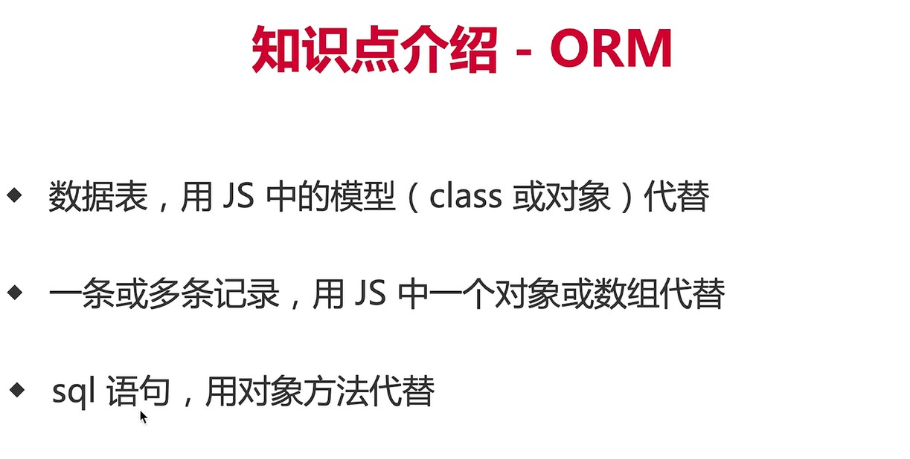

#### 7.1 安装

```
// 1.新建文件夹
npm init -y
npm i mysql2
npm i sequelize
//
```

#### 7.1 建模（外键） & 同步到数据库

#### 7.2 增删改查 & 连表查询

1.总结
2.er图
3.https://www.cnblogs.com/jardeng/p/12899019.html