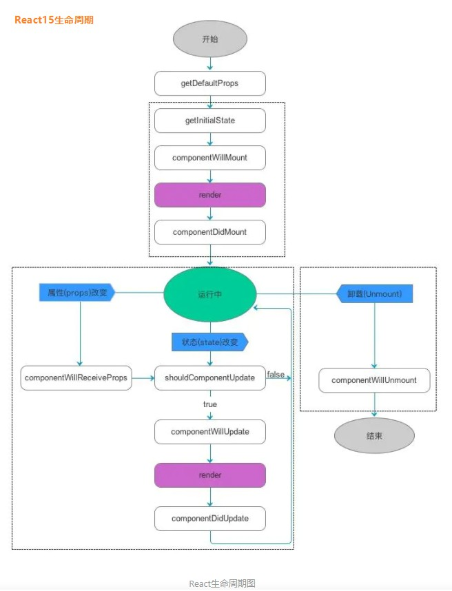
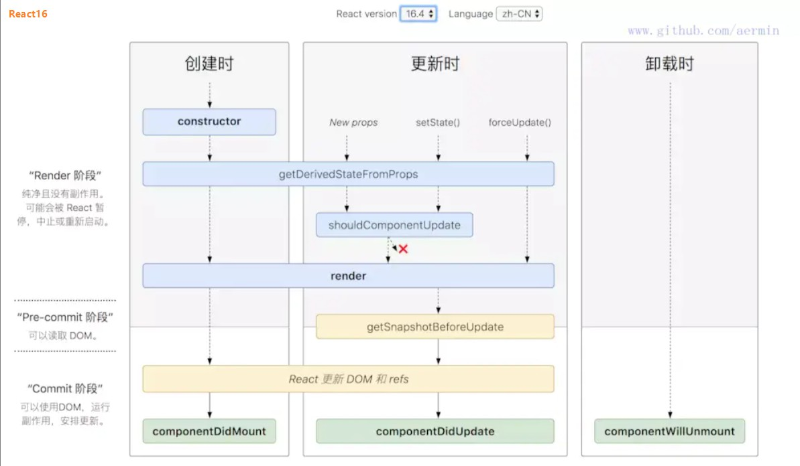

### 一、基础使用

https://www.runoob.com/react/react-state.html

### 二、生命周期:

https://www.jianshu.com/p/b331d0e4b398

react15生命周期:

react16生命周期:

### 三、项目代码

https://github.com/AlexLXL/SGG_002.react-admin/tree/dev

### 四、补充知识点

<React.Fragment></React.Fragment> 补充空节点

### 五、动态加载
https://www.jianshu.com/p/6d3a1ef461b1